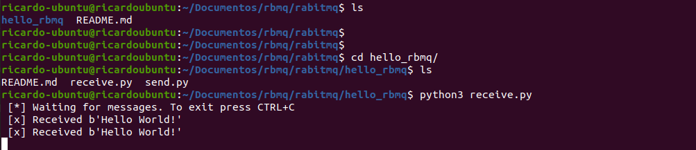

# Hello World com Rabbit MQ

O objetivo deste estudo é ajudar os estudantes da área de tecnologia com o uso do software
de mensageria chamado **RabbitMQ**.

O estudo aplicado no momento é a primera etapa apresentada no próprio site do **RabbitMQ** e
será todo estruturado na linguagem de programação Python.

[link para o site do RabbitMQ](https://www.rabbitmq.com/)

## Requisitos

- Ter o Python 3.6+ instalado em sua máquina
- Instalar o Docker
- Uma IDE de preferência
- Realizar a instalação do pacote descrito abaixo

```bash
python -m pip install pika --upgrade
```

## Como funciona o código

Este exemplo de uso é o inicial conforme é disponibilizado no próprio site do **RabbitMQ**, e para
executá-lo vamos precisar ter dois códigos produzidos, o de envio e o de recepção.

### send.py

Código responsável por compor a configuração de envio das mensagens. Nele criamos uma conexão,
damos um nome a lista que será enviada e determinamos como enviar a mensagem.
Utilização de métodos obtidos do pacote baixado (veja a sessão requisitos).

### receive.py

Código responsável por compor a configuração de recebimento das mensagens. Nele criamos uma 
estrutura parecida com a de envio, porém acrescentamos um método para consumir o oque nos
foi enviado.
Utilização de métodos obtidos do pacote baixado (veja a sessão requisitos).

## Como executar o envio da mensagem

Após escrever os dois códigos, precisamos executar algumas etapas para que o processo seja
executado.

1. Com o Docker instalado execute o seguinte comando `sudo docker run -it --rm --name rabbitmq -p 5672:5672 -p 15672:15672 rabbitmq:3-management`

2. Com um terminal aberto, execute o código `receive.py`, ele irá ficar esperando até que receba algo.

3. Com outro terminal aberto, execute o código `send.py`, ele irá enviar a mensagem.


